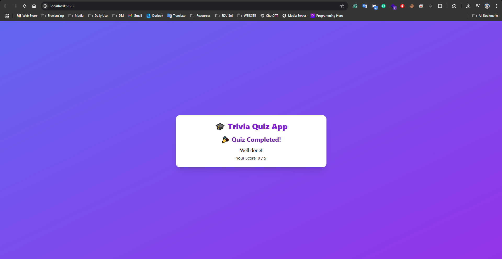

# 🎓 Trivia Quiz App

A beautifully styled, interactive quiz app built with **React + Tailwind CSS**, using real-time questions from the [Open Trivia DB](https://opentdb.com/). Users answer questions, get instant feedback, and see a final score — all with smooth animations and responsive design.

---

## 📸 Preview

  
> *Customize this image once deployed*

---

## 🚀 Features

- 🔀 Fetches random multiple-choice questions (category: General Knowledge)
- ✅ Submit button to confirm selected answers
- ✅ Shows correct & incorrect answers with visual feedback
- 🧠 Tracks score in real-time
- 📱 Fully responsive layout
- 🎨 Clean modern UI with TailwindCSS utility classes
- 🔒 Disabled answer interaction after submission
- 🧑 User can input their name for personalized feedback

---

## 🧪 Technologies Used

- ⚛️ React (with Vite)
- 🌐 Open Trivia DB API
- 🎨 TailwindCSS
- 💡 JSX, useState, useEffect hooks

---

## 🔧 Installation & Running

```bash
# 1. Clone the repo
git clone https://github.com/arafat-haider/trivia-quiz-app.git

# 2. Go into the project directory
cd trivia-quiz-app

# 3. Install dependencies
npm install

# 4. Start the development server
npm run dev

# 5. Open in browser
http://localhost:5173
```

---

## 🛠 Project Structure

```bash
📁 src
 ┣ 📄 QuizApp.jsx      # Main logic and UI
 ┣ 📄 main.jsx         # React DOM mount
 ┣ 📄 index.css        # TailwindCSS import
┣ 📄 index.html        # App root
┣ 📄 tailwind.config.js
┣ 📄 postcss.config.js
┣ 📄 package.json
```

---

## 🧠 Future Improvements

- 🏆 Add leaderboard and user ranking
- 🕒 Timer per question
- 🧾 Category/difficulty selection
- 🔖 Store history in `localStorage`
- 🌍 Offline question bank (100+ MCQs)

---

## 📦 Deployment

You can deploy this app easily on:
- [Vercel](https://vercel.com)
- [Netlify](https://netlify.com)
- [GitHub Pages](https://pages.github.com)

---

## 📄 License

MIT License  
© 2025 [Your Name](https://github.com/yourusername)

---

> 💬 **Made with 💙 for learners, by a learner**
